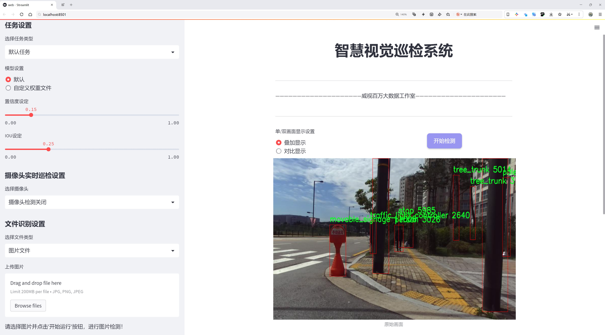
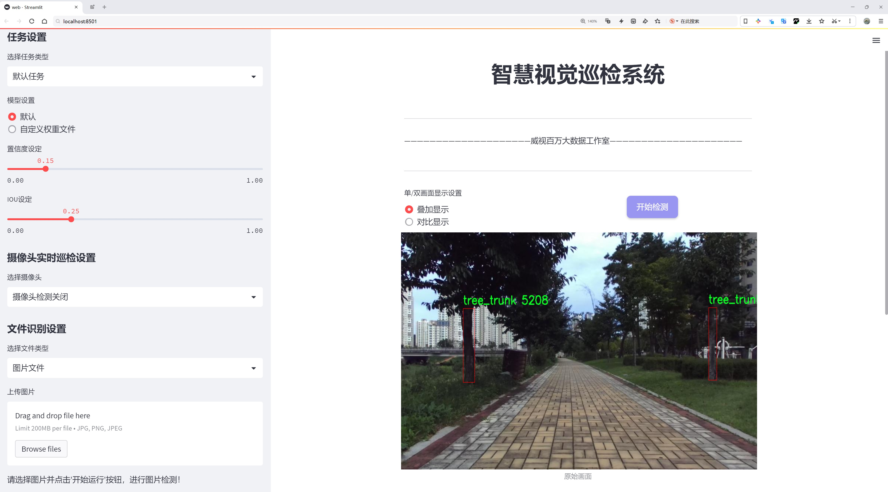
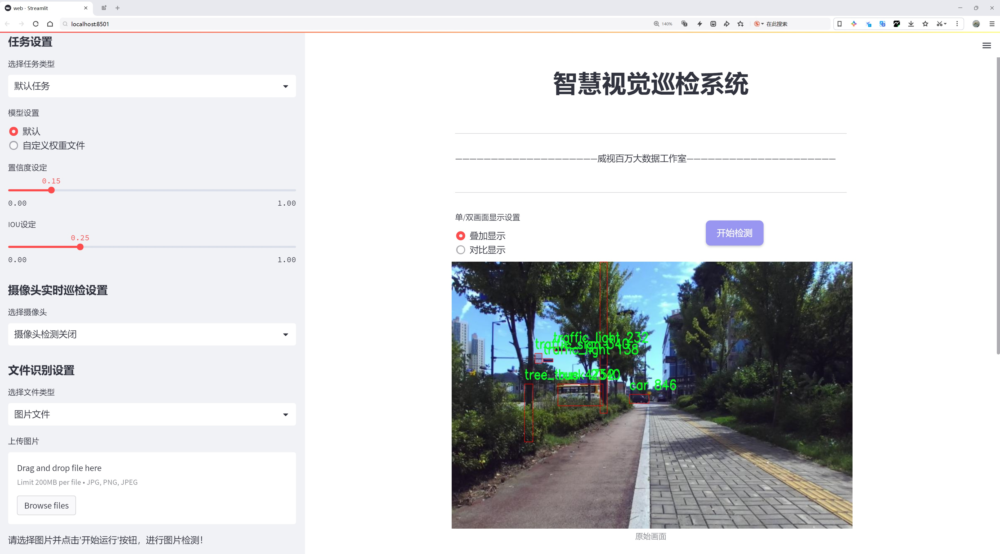
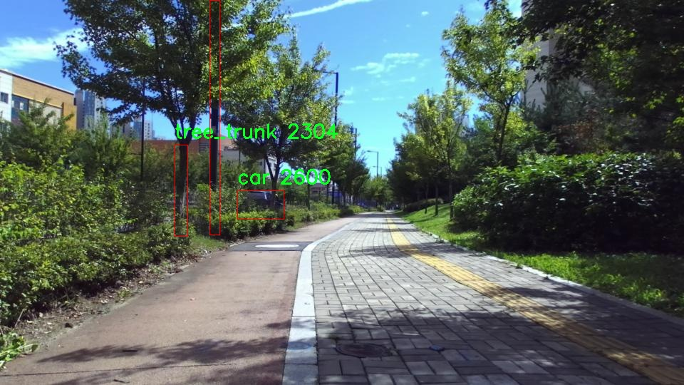
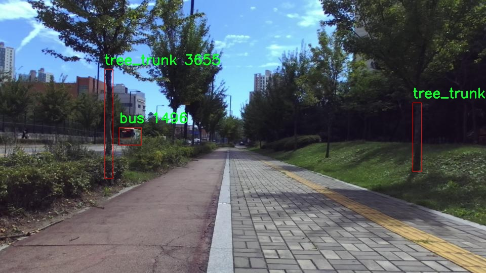
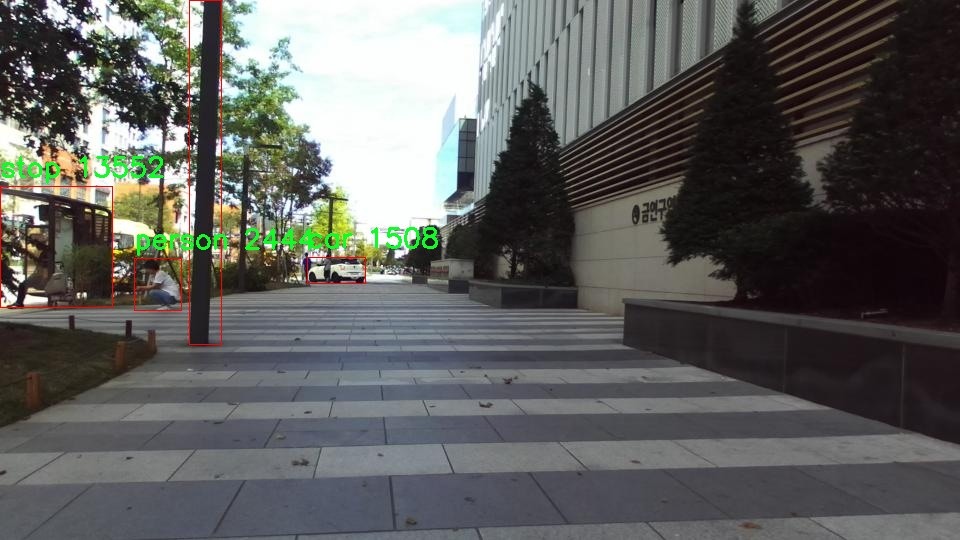
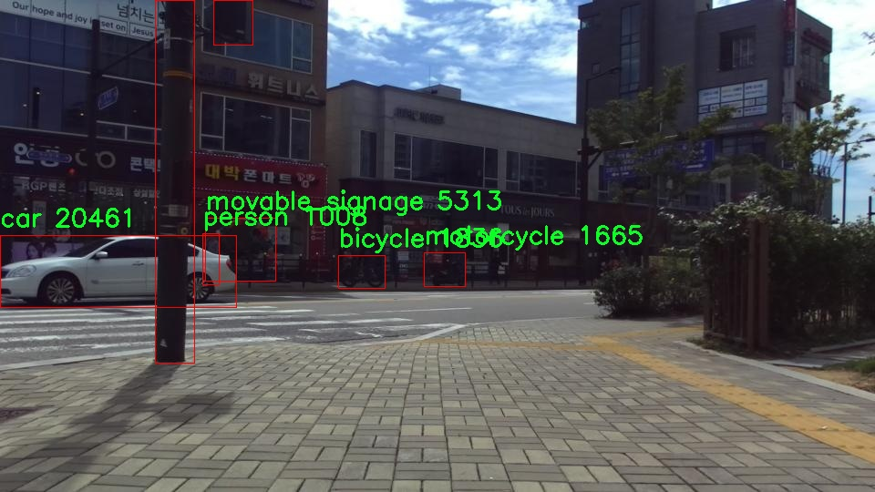

# 城市路边障碍物检测检测系统源码分享
 # [一条龙教学YOLOV8标注好的数据集一键训练_70+全套改进创新点发刊_Web前端展示]

### 1.研究背景与意义

项目参考[AAAI Association for the Advancement of Artificial Intelligence](https://gitee.com/qunmasj/projects)

项目来源[AACV Association for the Advancement of Computer Vision](https://kdocs.cn/l/cszuIiCKVNis)

研究背景与意义

随着城市化进程的加快，城市交通的复杂性和多样性日益增加，城市路边障碍物的管理与检测成为了城市智能交通系统中的一个重要课题。路边障碍物不仅包括常见的交通设施，如交通信号灯、交通标志、路障等，还涵盖了各种可能影响交通流畅性和行人安全的物体，如自行车、行人、公共设施等。因此，开发一种高效、准确的城市路边障碍物检测系统，对于提升城市交通管理水平、保障行人安全、优化交通流量具有重要的现实意义。

在这一背景下，YOLO（You Only Look Once）系列目标检测算法因其高效性和实时性，逐渐成为计算机视觉领域的研究热点。YOLOv8作为该系列的最新版本，结合了深度学习的先进技术，具备了更强的特征提取能力和更快的处理速度，适合于复杂的城市环境下进行障碍物检测。然而，YOLOv8在特定场景下的检测精度和鲁棒性仍然面临挑战，尤其是在多类别障碍物的检测中。因此，基于改进YOLOv8的城市路边障碍物检测系统的研究显得尤为重要。

本研究所使用的数据集包含3919张图像，涵盖了26个类别的障碍物。这些类别包括了从常见的交通工具（如汽车、公交车、摩托车）到公共设施（如长椅、花坛、交通信号灯）等多种物体，充分反映了城市路边环境的复杂性。通过对这些数据的深入分析与处理，能够为改进YOLOv8算法提供丰富的训练样本，从而提升其在实际应用中的表现。特别是在多样化的城市场景中，如何有效地识别和分类这些障碍物，将直接影响到智能交通系统的决策与管理。

此外，城市路边障碍物的检测不仅是交通管理的需求，也是智能城市建设的重要组成部分。通过实现对路边障碍物的实时监测与识别，可以为城市规划、交通流量分析、公共安全管理等提供数据支持。基于改进YOLOv8的检测系统，能够有效提升障碍物检测的准确性和实时性，为城市交通管理提供智能化解决方案。

综上所述，基于改进YOLOv8的城市路边障碍物检测系统的研究，不仅具有重要的学术价值，也具备广泛的应用前景。通过优化目标检测算法，结合丰富的城市障碍物数据集，能够为城市交通管理提供更为精准的技术支持，推动智能交通系统的进一步发展，最终实现更安全、高效的城市交通环境。

### 2.图片演示







##### 注意：由于此博客编辑较早，上面“2.图片演示”和“3.视频演示”展示的系统图片或者视频可能为老版本，新版本在老版本的基础上升级如下：（实际效果以升级的新版本为准）

  （1）适配了YOLOV8的“目标检测”模型和“实例分割”模型，通过加载相应的权重（.pt）文件即可自适应加载模型。

  （2）支持“图片识别”、“视频识别”、“摄像头实时识别”三种识别模式。

  （3）支持“图片识别”、“视频识别”、“摄像头实时识别”三种识别结果保存导出，解决手动导出（容易卡顿出现爆内存）存在的问题，识别完自动保存结果并导出到tempDir中。

  （4）支持Web前端系统中的标题、背景图等自定义修改，后面提供修改教程。

  另外本项目提供训练的数据集和训练教程,暂不提供权重文件（best.pt）,需要您按照教程进行训练后实现图片演示和Web前端界面演示的效果。

### 3.视频演示

[3.1 视频演示](https://www.bilibili.com/video/BV174xPewEWy/)

### 4.数据集信息展示

##### 4.1 本项目数据集详细数据（类别数＆类别名）

nc: 26
names: ['barricade', 'bench', 'bicycle', 'bollard', 'bus', 'car', 'carrier', 'chair', 'dog', 'fire_hydrant', 'kiosk', 'motorcycle', 'movable_signage', 'person', 'pole', 'potted_plant', 'power_controller', 'stop', 'stroller', 'table', 'traffic_light', 'traffic_light_controller', 'traffic_sign', 'tree_trunk', 'truck', 'wheelchair']


##### 4.2 本项目数据集信息介绍

数据集信息展示

在本研究中，我们使用的数据集名为“yolo”，旨在训练和改进YOLOv8模型，以实现高效的城市路边障碍物检测。该数据集专注于城市环境中的多种障碍物，涵盖了26个不同的类别，确保了模型在实际应用中的广泛适应性和准确性。通过精心标注和丰富的样本，数据集为YOLOv8的训练提供了坚实的基础，帮助其在复杂的城市场景中识别和分类各种障碍物。

数据集中包含的类别包括“barricade”（路障）、“bench”（长椅）、“bicycle”（自行车）、“bollard”（路桩）、“bus”（公交车）、“car”（汽车）、“carrier”（手推车）、“chair”（椅子）、“dog”（狗）、“fire_hydrant”（消防栓）、“kiosk”（ kiosks）、“motorcycle”（摩托车）、“movable_signage”（可移动标识）、“person”（行人）、“pole”（电杆）、“potted_plant”（盆栽植物）、“power_controller”（电源控制器）、“stop”（停车标志）、“stroller”（婴儿车）、“table”（桌子）、“traffic_light”（交通信号灯）、“traffic_light_controller”（交通信号灯控制器）、“traffic_sign”（交通标志）、“tree_trunk”（树干）、“truck”（卡车）和“wheelchair”（轮椅）。这些类别涵盖了城市环境中常见的各种障碍物，确保了模型在实际应用中能够识别和处理多种情况。

在数据集的构建过程中，研究团队对每个类别进行了详细的标注，确保每个样本都准确反映了其在城市环境中的实际特征。这种高质量的标注不仅提高了模型的训练效果，也为后续的验证和测试提供了可靠的数据支持。数据集中的样本来自于不同的城市场景，包括繁忙的街道、公园、商业区和住宅区等，充分考虑了城市环境的多样性和复杂性。这种多样性使得模型在面对不同的障碍物时，能够展现出更强的鲁棒性和适应性。

此外，数据集的设计还考虑到了实际应用中的实时性需求。通过优化样本的选择和标注策略，确保了模型在进行障碍物检测时能够快速响应，满足城市交通管理和智能出行的需求。随着城市化进程的加快，城市路边障碍物的检测和管理变得愈发重要，而“yolo”数据集的使用，将为相关技术的发展提供重要的支持。

总之，“yolo”数据集的构建不仅为YOLOv8模型的训练提供了丰富的样本和高质量的标注，还为城市路边障碍物检测的研究提供了重要的基础。通过对多种障碍物的全面覆盖和精确标注，该数据集将有助于提升模型的检测能力，为智能交通系统的建设和城市管理的优化贡献力量。随着技术的不断进步和数据集的不断完善，我们期待未来在城市障碍物检测领域取得更大的突破。










### 5.全套项目环境部署视频教程（零基础手把手教学）

[5.1 环境部署教程链接（零基础手把手教学）](https://www.ixigua.com/7404473917358506534?logTag=c807d0cbc21c0ef59de5)


[5.2 安装Python虚拟环境创建和依赖库安装视频教程链接（零基础手把手教学）](https://www.ixigua.com/7404474678003106304?logTag=1f1041108cd1f708b01a)

### 6.手把手YOLOV8训练视频教程（零基础小白有手就能学会）

[6.1 手把手YOLOV8训练视频教程（零基础小白有手就能学会）](https://www.ixigua.com/7404477157818401292?logTag=d31a2dfd1983c9668658)

### 7.70+种全套YOLOV8创新点代码加载调参视频教程（一键加载写好的改进模型的配置文件）

[7.1 70+种全套YOLOV8创新点代码加载调参视频教程（一键加载写好的改进模型的配置文件）](https://www.ixigua.com/7404478314661806627?logTag=29066f8288e3f4eea3a4)

### 8.70+种全套YOLOV8创新点原理讲解（非科班也可以轻松写刊发刊，V10版本正在科研待更新）

由于篇幅限制，每个创新点的具体原理讲解就不一一展开，具体见下列网址中的创新点对应子项目的技术原理博客网址【Blog】：


[8.1 70+种全套YOLOV8创新点原理讲解链接](https://gitee.com/qunmasj/good)

### 9.系统功能展示（检测对象为举例，实际内容以本项目数据集为准）

图9.1.系统支持检测结果表格显示

  图9.2.系统支持置信度和IOU阈值手动调节

  图9.3.系统支持自定义加载权重文件best.pt(需要你通过步骤5中训练获得)

  图9.4.系统支持摄像头实时识别

  图9.5.系统支持图片识别

  图9.6.系统支持视频识别

  图9.7.系统支持识别结果文件自动保存

  图9.8.系统支持Excel导出检测结果数据


### 10.原始YOLOV8算法原理

原始YOLOv8算法原理

YOLOv8算法是Ultralytics公司在2023年推出的目标检测领域的一次重要突破，标志着YOLO系列算法的又一次重大更新。YOLOv8在前几代版本的基础上，进行了多项关键改进，旨在提升目标检测的准确性、速度和灵活性。其设计理念围绕着快速、准确和易于使用的原则，使其在广泛的应用场景中都表现出色，尤其是在目标检测、图像分割和图像分类等任务中。

首先，YOLOv8的输入部分采用了640x640的默认图像尺寸，但为了适应不同长宽比的图像，YOLOv8引入了自适应图片缩放技术。这种技术通过将图像的长边按比例缩小到指定尺寸，然后对短边进行填充，从而减少了信息冗余，提升了目标检测和推理的速度。此外，在模型训练阶段，YOLOv8使用了Mosaic图像增强技术，这一技术通过随机选择四张图像进行缩放和拼接，生成新的训练样本，促使模型学习不同位置和周围像素的特征，从而有效提高了模型的预测精度。

在网络结构方面，YOLOv8的主干网络部分做出了显著改进，特别是将YOLOv5中的C3模块替换为C2F模块。C2F模块通过并行化更多的梯度流分支，在保持轻量化的同时，获取了更丰富的梯度信息，进而提升了模型的精度和响应速度。YOLOv8的Neck部分也进行了优化，去除了多余的卷积连接层，直接对不同阶段输出的特征进行上采样，进一步简化了网络结构，提高了特征融合的效率。

YOLOv8的Head部分是其结构变化最大的地方。该算法从Coupled-Head（耦合头）转变为Decoupled-Head（解耦头），使得检测和分类的卷积过程相互独立。通过这种解耦设计，YOLOv8能够更好地处理目标检测中的复杂性，分别优化类别预测和边界框回归。此外，YOLOv8抛弃了传统的Anchor-Based（基于锚框）方法，转而采用Anchor-Free（无锚框）的方法。这一转变使得目标检测的过程更加灵活，避免了对锚框的预设和计算，从而降低了运算复杂度，并提升了模型的泛化能力。

在损失函数的设计上，YOLOv8引入了新的策略。为了提高模型的训练效率和预测准确性，YOLOv8在分类损失中使用了BCELoss（Binary Cross Entropy Loss），而在边界框回归中则采用了DFL（Distribution Focal Loss）和CIoULoss（Complete Intersection over Union Loss）。这种组合损失函数的设计使得模型能够更快地聚焦于标签附近的数值，提升了检测精度。

值得一提的是，YOLOv8在轻量化方面也做出了努力，特别是YOLOv8n模型的设计。该模型通过使用更轻量的C2F模块替代C3模块，并减少降采样层的数量，进一步降低了算法的复杂度。同时，YOLOv8n的特征融合网络结合了特征金字塔网络（FPN）和路径聚合网络（PAN），并引入了BiFPN网络，以提高对不同尺度特征信息的提取速度。这些改进使得YOLOv8在保持高性能的同时，能够在资源受限的环境中高效运行。

综上所述，YOLOv8算法通过一系列创新的设计和改进，极大地提升了目标检测的性能。其自适应输入处理、优化的网络结构、解耦的检测头以及灵活的损失函数设计，使得YOLOv8在多种应用场景中都展现出了卓越的能力。无论是在实时检测还是在复杂环境下，YOLOv8都能够提供快速而准确的结果，成为当前目标检测领域的一项重要工具。随着YOLOv8的不断发展和应用，未来在目标检测、图像分析等领域的潜力将更加广阔。


### 11.项目核心源码讲解（再也不用担心看不懂代码逻辑）

#### 11.1 ui.py

以下是经过简化和注释的核心代码部分：

```python
import sys
import subprocess
from QtFusion.path import abs_path

def run_script(script_path):
    """
    使用当前 Python 环境运行指定的脚本。

    Args:
        script_path (str): 要运行的脚本路径
    """
    # 获取当前 Python 解释器的路径
    python_path = sys.executable

    # 构建运行命令，使用 streamlit 运行指定的脚本
    command = f'"{python_path}" -m streamlit run "{script_path}"'

    # 执行命令并获取结果
    result = subprocess.run(command, shell=True)
    
    # 检查命令执行结果，如果返回码不为0，则表示出错
    if result.returncode != 0:
        print("脚本运行出错。")

# 主程序入口
if __name__ == "__main__":
    # 获取要运行的脚本的绝对路径
    script_path = abs_path("web.py")

    # 调用函数运行脚本
    run_script(script_path)
```

### 代码分析和注释：

1. **导入模块**：
   - `sys`：用于访问与 Python 解释器相关的变量和函数。
   - `subprocess`：用于执行外部命令和获取其输出。
   - `abs_path`：从 `QtFusion.path` 模块导入的函数，用于获取文件的绝对路径。

2. **`run_script` 函数**：
   - 该函数接收一个脚本路径作为参数，并使用当前 Python 环境来运行该脚本。
   - 使用 `sys.executable` 获取当前 Python 解释器的路径。
   - 构建一个命令字符串，使用 `streamlit` 来运行指定的脚本。
   - 使用 `subprocess.run` 执行命令，并检查返回码以判断脚本是否成功运行。

3. **主程序入口**：
   - 在 `if __name__ == "__main__":` 块中，确保只有在直接运行该脚本时才会执行以下代码。
   - 调用 `abs_path` 函数获取 `web.py` 的绝对路径。
   - 最后，调用 `run_script` 函数来运行指定的脚本。

这段代码的核心功能是使用当前 Python 环境运行一个指定的 Streamlit 脚本，并在运行失败时输出错误信息。

这个程序文件名为 `ui.py`，其主要功能是通过当前的 Python 环境来运行一个指定的脚本，具体是使用 Streamlit 来启动一个 Web 应用。

首先，文件导入了几个必要的模块，包括 `sys`、`os` 和 `subprocess`。其中，`sys` 模块用于访问与 Python 解释器相关的变量和函数，`os` 模块提供了与操作系统交互的功能，而 `subprocess` 模块则用于创建新进程、连接到它们的输入/输出/错误管道，并获取它们的返回码。

接下来，文件中定义了一个名为 `run_script` 的函数。这个函数接受一个参数 `script_path`，它是要运行的脚本的路径。函数内部首先获取当前 Python 解释器的路径，并将其存储在 `python_path` 变量中。然后，构建一个命令字符串，该命令用于运行指定的脚本，命令格式为 `python -m streamlit run script_path`。这里使用了 `streamlit` 模块来启动 Web 应用。

随后，使用 `subprocess.run` 方法执行构建好的命令。如果命令执行的返回码不为零，表示脚本运行过程中出现了错误，此时会打印出“脚本运行出错。”的提示信息。

在文件的最后部分，使用 `if __name__ == "__main__":` 语句来判断该文件是否是作为主程序运行。如果是，则指定要运行的脚本路径为 `web.py`，并调用 `run_script` 函数来执行这个脚本。

总的来说，这个程序的核心功能是通过当前的 Python 环境来运行一个名为 `web.py` 的 Streamlit 脚本，从而启动一个 Web 应用。

#### 11.2 code\ultralytics\models\nas\val.py

以下是代码中最核心的部分，并附上详细的中文注释：

```python
import torch
from ultralytics.utils import ops

class NASValidator:
    """
    Ultralytics YOLO NAS 验证器，用于目标检测。

    该类用于后处理由 YOLO NAS 模型生成的原始预测结果。它执行非最大抑制（NMS），以去除重叠和低置信度的框，最终生成最终检测结果。
    """

    def postprocess(self, preds_in):
        """对预测输出应用非最大抑制（NMS）。"""
        # 将预测结果的边界框从 xyxy 格式转换为 xywh 格式
        boxes = ops.xyxy2xywh(preds_in[0][0])
        
        # 将边界框和对应的置信度进行拼接，并调整维度
        preds = torch.cat((boxes, preds_in[0][1]), -1).permute(0, 2, 1)
        
        # 应用非最大抑制，去除重叠的框
        return ops.non_max_suppression(
            preds,                          # 预测结果
            self.args.conf,                 # 置信度阈值
            self.args.iou,                  # IoU 阈值
            labels=self.lb,                 # 多标签 NMS 的标签
            multi_label=False,              # 是否启用多标签模式
            agnostic=self.args.single_cls,  # 是否使用类别无关的 NMS
            max_det=self.args.max_det,      # 最大检测框数量
            max_time_img=0.5,               # 每张图像的最大处理时间
        )
```

### 代码核心部分解释：
1. **导入模块**：
   - `torch`：用于张量操作和深度学习模型的构建。
   - `ops`：包含用于处理预测结果的操作函数。

2. **类定义**：
   - `NASValidator`：继承自 `DetectionValidator`，用于处理 YOLO NAS 模型的预测结果。

3. **postprocess 方法**：
   - 该方法接收原始预测结果 `preds_in`，并对其进行后处理。
   - 使用 `ops.xyxy2xywh` 将边界框从 `xyxy` 格式转换为 `xywh` 格式，以便于后续处理。
   - 将边界框和对应的置信度拼接在一起，并调整维度以适应后续的 NMS 操作。
   - 调用 `ops.non_max_suppression` 进行非最大抑制，去除重叠的检测框，最终返回处理后的结果。

### 注意事项：
- 该类通常不会直接实例化，而是在 `NAS` 类内部使用。

这个程序文件是Ultralytics YOLO（You Only Look Once）模型的一部分，专门用于对象检测的验证过程。文件中定义了一个名为`NASValidator`的类，它继承自`DetectionValidator`，并且旨在对YOLO NAS模型生成的原始预测结果进行后处理。

在类的文档字符串中，首先介绍了`NASValidator`的功能。它的主要任务是执行非极大值抑制（Non-Maximum Suppression, NMS），以去除重叠和低置信度的边界框，从而生成最终的检测结果。该类的属性包括`args`，这是一个命名空间对象，包含了后处理所需的各种配置，例如置信度和IoU（Intersection over Union）阈值。此外，还有一个可选的张量`lb`，用于多标签NMS。

在示例代码中，展示了如何使用`NASValidator`。首先导入了`NAS`类，然后创建了一个YOLO NAS模型的实例，接着获取该模型的验证器。假设已经有了原始预测结果`raw_preds`，通过调用`validator.postprocess(raw_preds)`可以得到最终的预测结果。

值得注意的是，这个类通常不会被直接实例化，而是在`NAS`类内部使用。 

在`postprocess`方法中，具体实现了对预测输出的后处理。首先，将输入的预测结果`preds_in`中的边界框坐标从xyxy格式转换为xywh格式。然后，将边界框和相应的置信度合并，并进行维度调整。最后，调用`ops.non_max_suppression`方法执行非极大值抑制，返回最终的检测结果。该方法中使用了之前提到的各种参数，如置信度阈值、IoU阈值等，以确保检测结果的准确性和有效性。

#### 11.3 70+种YOLOv8算法改进源码大全和调试加载训练教程（非必要）\ultralytics\nn\modules\block.py

以下是经过简化并注释的核心代码部分，主要保留了 YOLO 模型中的一些重要模块：

```python
import torch
import torch.nn as nn
import torch.nn.functional as F

class DFL(nn.Module):
    """
    分布焦点损失（DFL）模块。
    用于计算目标检测中的焦点损失。
    """

    def __init__(self, c1=16):
        """初始化一个卷积层，输入通道数为 c1。"""
        super().__init__()
        # 定义一个卷积层，将 c1 通道映射到 1 通道
        self.conv = nn.Conv2d(c1, 1, 1, bias=False).requires_grad_(False)
        # 初始化卷积层的权重为 [0, 1, ..., c1-1]
        x = torch.arange(c1, dtype=torch.float)
        self.conv.weight.data[:] = nn.Parameter(x.view(1, c1, 1, 1))
        self.c1 = c1

    def forward(self, x):
        """前向传播，应用 DFL 模块。"""
        b, c, a = x.shape  # b: batch size, c: channels, a: anchors
        # 对输入进行变形和 softmax 操作，然后通过卷积层
        return self.conv(x.view(b, 4, self.c1, a).transpose(2, 1).softmax(1)).view(b, 4, a)


class Proto(nn.Module):
    """YOLOv8 掩膜原型模块，用于分割模型。"""

    def __init__(self, c1, c_=256, c2=32):
        """初始化 YOLOv8 掩膜原型模块。"""
        super().__init__()
        self.cv1 = Conv(c1, c_, k=3)  # 第一个卷积层
        self.upsample = nn.ConvTranspose2d(c_, c_, 2, 2, 0, bias=True)  # 上采样层
        self.cv2 = Conv(c_, c_, k=3)  # 第二个卷积层
        self.cv3 = Conv(c_, c2)  # 第三个卷积层

    def forward(self, x):
        """前向传播，执行上采样和卷积操作。"""
        return self.cv3(self.cv2(self.upsample(self.cv1(x))))


class HGStem(nn.Module):
    """
    PPHGNetV2 的 StemBlock，包含多个卷积和一个最大池化层。
    """

    def __init__(self, c1, cm, c2):
        """初始化 StemBlock，定义卷积层和池化层。"""
        super().__init__()
        self.stem1 = Conv(c1, cm, 3, 2)  # 第一个卷积层
        self.stem2a = Conv(cm, cm // 2, 2, 1, 0)  # 第二个卷积层
        self.stem2b = Conv(cm // 2, cm, 2, 1, 0)  # 第三个卷积层
        self.stem3 = Conv(cm * 2, cm, 3, 2)  # 第四个卷积层
        self.stem4 = Conv(cm, c2, 1, 1)  # 第五个卷积层
        self.pool = nn.MaxPool2d(kernel_size=2, stride=1, padding=0, ceil_mode=True)  # 最大池化层

    def forward(self, x):
        """前向传播，执行多个卷积和池化操作。"""
        x = self.stem1(x)  # 通过第一个卷积层
        x = F.pad(x, [0, 1, 0, 1])  # 填充
        x2 = self.stem2a(x)  # 通过第二个卷积层
        x2 = F.pad(x2, [0, 1, 0, 1])  # 填充
        x2 = self.stem2b(x2)  # 通过第三个卷积层
        x1 = self.pool(x)  # 通过最大池化层
        x = torch.cat([x1, x2], dim=1)  # 拼接
        x = self.stem3(x)  # 通过第四个卷积层
        x = self.stem4(x)  # 通过第五个卷积层
        return x


class Bottleneck(nn.Module):
    """标准瓶颈模块。"""

    def __init__(self, c1, c2, shortcut=True, g=1, k=(3, 3), e=0.5):
        """初始化瓶颈模块，定义输入输出通道、是否使用快捷连接等。"""
        super().__init__()
        c_ = int(c2 * e)  # 隐藏通道数
        self.cv1 = Conv(c1, c_, k[0], 1)  # 第一个卷积层
        self.cv2 = Conv(c_, c2, k[1], 1, g=g)  # 第二个卷积层
        self.add = shortcut and c1 == c2  # 是否使用快捷连接

    def forward(self, x):
        """前向传播，应用瓶颈结构。"""
        return x + self.cv2(self.cv1(x)) if self.add else self.cv2(self.cv1(x))
```

### 代码说明
1. **DFL 类**：实现了分布焦点损失的计算，主要用于目标检测中的损失函数。
2. **Proto 类**：YOLOv8 掩膜原型模块，负责处理分割任务中的掩膜生成。
3. **HGStem 类**：构建了 PPHGNetV2 的 StemBlock，包含多个卷积层和一个最大池化层，用于特征提取。
4. **Bottleneck 类**：实现了标准的瓶颈结构，通常用于深度神经网络中以减少参数数量并提高模型的表现。

这些模块是 YOLO 模型的核心部分，负责特征提取和损失计算。

这个程序文件是YOLOv8算法的一部分，主要实现了一些基础的模块和层，这些模块在YOLOv8的网络结构中起到重要的作用。文件中包含了多个类，每个类都定义了特定的神经网络层或模块，通常用于构建更复杂的网络结构。

首先，文件导入了必要的库，包括PyTorch的核心库和一些自定义的卷积模块。接着，定义了一系列的类，这些类都继承自`nn.Module`，这是PyTorch中所有神经网络模块的基类。

`DFL`类实现了分布焦点损失（Distribution Focal Loss），这是YOLOv8中用于处理类别不平衡的一种损失函数。它通过卷积层将输入张量转换为输出张量，并在前向传播中应用了softmax函数。

`Proto`类是YOLOv8中用于分割模型的掩膜原型模块。它通过多个卷积层和上采样层处理输入数据，生成最终的输出。

`HGStem`类实现了PPHGNetV2的StemBlock，包含了多个卷积层和一个最大池化层，用于特征提取。

`HGBlock`类则是PPHGNetV2中的一个模块，包含了多个卷积层，并且可以选择使用轻量级卷积（LightConv）。这个模块的设计允许在不同的层之间使用跳跃连接。

`SPP`和`SPPF`类实现了空间金字塔池化（Spatial Pyramid Pooling）层，分别用于不同的网络版本。SPP层通过不同大小的池化操作来提取多尺度特征。

`C1`、`C2`、`C2f`、`C3`等类实现了不同类型的CSP（Cross Stage Partial）瓶颈模块。这些模块通过不同数量的卷积层和跳跃连接来构建深层网络，以提高特征提取的效率和效果。

`GhostBottleneck`类实现了GhostNet中的瓶颈结构，旨在通过减少参数量和计算量来提高网络的效率。

`Bottleneck`和`BottleneckCSP`类则实现了标准的瓶颈结构和CSP瓶颈结构，分别用于不同的网络设计需求。

总的来说，这个文件定义了一系列基础模块和层，旨在为YOLOv8算法提供灵活的构建块，以便在不同的任务和数据集上进行训练和推理。这些模块的设计充分考虑了计算效率和模型性能，使得YOLOv8能够在各种视觉任务中表现出色。

#### 11.4 code\ultralytics\utils\callbacks\hub.py

以下是代码中最核心的部分，并附上详细的中文注释：

```python
import json
from time import time
from ultralytics.hub.utils import HUB_WEB_ROOT, PREFIX, events
from ultralytics.utils import LOGGER, SETTINGS

def on_fit_epoch_end(trainer):
    """在每个训练周期结束时上传训练进度指标。"""
    session = getattr(trainer, "hub_session", None)  # 获取训练器的hub会话
    if session:
        # 收集训练损失和指标
        all_plots = {
            **trainer.label_loss_items(trainer.tloss, prefix="train"),  # 获取训练损失
            **trainer.metrics,  # 获取训练指标
        }
        if trainer.epoch == 0:
            from ultralytics.utils.torch_utils import model_info_for_loggers
            # 在第一个周期中，添加模型信息
            all_plots = {**all_plots, **model_info_for_loggers(trainer)}

        # 将当前周期的指标数据序列化为JSON格式并存入队列
        session.metrics_queue[trainer.epoch] = json.dumps(all_plots)
        
        # 检查是否超过上传限制时间
        if time() - session.timers["metrics"] > session.rate_limits["metrics"]:
            session.upload_metrics()  # 上传指标
            session.timers["metrics"] = time()  # 重置计时器
            session.metrics_queue = {}  # 重置队列

def on_model_save(trainer):
    """以速率限制的方式将检查点保存到Ultralytics HUB。"""
    session = getattr(trainer, "hub_session", None)  # 获取训练器的hub会话
    if session:
        is_best = trainer.best_fitness == trainer.fitness  # 判断当前模型是否是最佳模型
        # 检查是否超过上传检查点的时间限制
        if time() - session.timers["ckpt"] > session.rate_limits["ckpt"]:
            LOGGER.info(f"{PREFIX}Uploading checkpoint {HUB_WEB_ROOT}/models/{session.model_file}")  # 记录上传信息
            session.upload_model(trainer.epoch, trainer.last, is_best)  # 上传模型
            session.timers["ckpt"] = time()  # 重置计时器

def on_train_end(trainer):
    """在训练结束时将最终模型和指标上传到Ultralytics HUB。"""
    session = getattr(trainer, "hub_session", None)  # 获取训练器的hub会话
    if session:
        LOGGER.info(f"{PREFIX}Syncing final model...")  # 记录同步信息
        # 上传最终模型和指标
        session.upload_model(
            trainer.epoch,
            trainer.best,
            map=trainer.metrics.get("metrics/mAP50-95(B)", 0),  # 获取mAP指标
            final=True,
        )
        session.alive = False  # 停止心跳
        LOGGER.info(f"{PREFIX}Done ✅\n" f"{PREFIX}View model at {session.model_url} 🚀")  # 记录完成信息

# 定义回调函数
callbacks = (
    {
        "on_fit_epoch_end": on_fit_epoch_end,  # 训练周期结束时的回调
        "on_model_save": on_model_save,  # 模型保存时的回调
        "on_train_end": on_train_end,  # 训练结束时的回调
    }
    if SETTINGS["hub"] is True  # 如果hub设置为True，则启用回调
    else {}
)
```

### 代码核心部分说明：
1. **on_fit_epoch_end**: 该函数在每个训练周期结束时被调用，负责收集并上传训练进度指标。它会检查是否超过了上传限制的时间，并在合适的时机上传数据。

2. **on_model_save**: 该函数在模型保存时被调用，负责将当前模型的检查点上传到Ultralytics HUB，并确保遵循速率限制。

3. **on_train_end**: 该函数在训练结束时被调用，负责上传最终的模型和训练指标，并记录相关信息。

4. **callbacks**: 这是一个字典，包含了不同事件对应的回调函数，用于在特定事件发生时执行相应的操作。

这个程序文件是一个用于Ultralytics YOLO（一个流行的目标检测模型）训练过程中的回调函数实现，主要负责在不同训练阶段上传模型和训练进度的相关信息到Ultralytics HUB。文件中包含了一系列的回调函数，每个函数在特定的训练事件发生时被调用。

首先，`on_pretrain_routine_end`函数在预训练过程结束时被调用，主要用于记录上传速率限制的计时器。它检查训练器对象中是否存在hub_session，如果存在，则初始化一个计时器，用于跟踪上传指标和检查点的时间。

接下来，`on_fit_epoch_end`函数在每个训练周期结束时被调用，负责上传训练进度的指标。它同样检查hub_session，并在验证结束后上传相关的训练损失和其他指标。如果是第一个周期，还会记录模型的信息。上传的指标被存储在一个队列中，并根据设定的速率限制进行上传。

`on_model_save`函数在模型保存时被调用，负责将模型检查点上传到Ultralytics HUB。它会检查当前的训练状态，如果当前的训练表现是最佳的，则标记该模型为最佳模型，并在符合速率限制的情况下上传。

`on_train_end`函数在训练结束时被调用，负责上传最终的模型和相关的指标到Ultralytics HUB。它会记录模型的最佳状态，并在上传完成后停止心跳信号，表示训练的结束。

`on_train_start`、`on_val_start`、`on_predict_start`和`on_export_start`函数分别在训练、验证、预测和导出开始时被调用，主要用于执行与这些事件相关的操作。

最后，`callbacks`字典将这些回调函数组织在一起，只有在设置中启用了hub功能时，这些回调函数才会被注册和使用。这种设计使得在不同的训练阶段可以灵活地执行特定的操作，确保训练过程中的数据能够及时上传和记录。

#### 11.5 train.py

以下是经过简化并添加详细中文注释的核心代码部分：

```python
import random
import numpy as np
import torch.nn as nn
from ultralytics.data import build_dataloader, build_yolo_dataset
from ultralytics.engine.trainer import BaseTrainer
from ultralytics.models import yolo
from ultralytics.nn.tasks import DetectionModel
from ultralytics.utils import LOGGER, RANK
from ultralytics.utils.torch_utils import de_parallel, torch_distributed_zero_first

class DetectionTrainer(BaseTrainer):
    """
    扩展自 BaseTrainer 类的检测模型训练类。
    """

    def build_dataset(self, img_path, mode="train", batch=None):
        """
        构建 YOLO 数据集。

        参数:
            img_path (str): 包含图像的文件夹路径。
            mode (str): 模式，可以是 'train' 或 'val'，用户可以为每种模式自定义不同的增强。
            batch (int, optional): 批次大小，仅用于 'rect' 模式。默认为 None。
        """
        gs = max(int(de_parallel(self.model).stride.max() if self.model else 0), 32)
        return build_yolo_dataset(self.args, img_path, batch, self.data, mode=mode, rect=mode == "val", stride=gs)

    def get_dataloader(self, dataset_path, batch_size=16, rank=0, mode="train"):
        """构造并返回数据加载器。"""
        assert mode in ["train", "val"]
        with torch_distributed_zero_first(rank):  # 仅在 DDP 中初始化数据集 *.cache 一次
            dataset = self.build_dataset(dataset_path, mode, batch_size)
        shuffle = mode == "train"  # 训练模式下打乱数据
        workers = self.args.workers if mode == "train" else self.args.workers * 2
        return build_dataloader(dataset, batch_size, workers, shuffle, rank)  # 返回数据加载器

    def preprocess_batch(self, batch):
        """对一批图像进行预处理，包括缩放和转换为浮点数。"""
        batch["img"] = batch["img"].to(self.device, non_blocking=True).float() / 255  # 将图像转换为浮点数并归一化
        if self.args.multi_scale:  # 如果启用多尺度
            imgs = batch["img"]
            sz = (
                random.randrange(self.args.imgsz * 0.5, self.args.imgsz * 1.5 + self.stride)
                // self.stride
                * self.stride
            )  # 随机选择图像大小
            sf = sz / max(imgs.shape[2:])  # 计算缩放因子
            if sf != 1:
                ns = [
                    math.ceil(x * sf / self.stride) * self.stride for x in imgs.shape[2:]
                ]  # 计算新的形状
                imgs = nn.functional.interpolate(imgs, size=ns, mode="bilinear", align_corners=False)  # 进行插值
            batch["img"] = imgs
        return batch

    def get_model(self, cfg=None, weights=None, verbose=True):
        """返回 YOLO 检测模型。"""
        model = DetectionModel(cfg, nc=self.data["nc"], verbose=verbose and RANK == -1)  # 创建检测模型
        if weights:
            model.load(weights)  # 加载权重
        return model

    def plot_training_samples(self, batch, ni):
        """绘制带有注释的训练样本。"""
        plot_images(
            images=batch["img"],
            batch_idx=batch["batch_idx"],
            cls=batch["cls"].squeeze(-1),
            bboxes=batch["bboxes"],
            paths=batch["im_file"],
            fname=self.save_dir / f"train_batch{ni}.jpg",
            on_plot=self.on_plot,
        )

    def plot_metrics(self):
        """从 CSV 文件中绘制指标。"""
        plot_results(file=self.csv, on_plot=self.on_plot)  # 保存结果图
```

### 代码说明：
1. **DetectionTrainer 类**：该类用于实现基于 YOLO 模型的目标检测训练，继承自 `BaseTrainer`。
2. **build_dataset 方法**：根据给定的图像路径和模式构建数据集，支持训练和验证模式。
3. **get_dataloader 方法**：构造数据加载器，负责加载数据集并设置相关参数。
4. **preprocess_batch 方法**：对输入的图像批次进行预处理，包括归一化和可能的多尺度调整。
5. **get_model 方法**：创建并返回一个 YOLO 检测模型，支持加载预训练权重。
6. **plot_training_samples 方法**：绘制训练样本及其对应的标注，便于可视化训练过程。
7. **plot_metrics 方法**：从 CSV 文件中读取训练指标并绘制图表，便于监控训练效果。

这个程序文件 `train.py` 是一个用于训练 YOLO（You Only Look Once）目标检测模型的实现，继承自 `BaseTrainer` 类。它包含了一系列用于构建数据集、加载数据、预处理图像、设置模型属性、获取模型、验证模型、记录损失、显示训练进度、绘制训练样本和绘制训练指标的功能。

首先，文件导入了一些必要的库和模块，包括数学运算、随机数生成、深度学习框架 PyTorch 相关的模块，以及 YOLO 相关的工具和函数。然后定义了 `DetectionTrainer` 类，该类专门用于处理目标检测任务。

在 `DetectionTrainer` 类中，`build_dataset` 方法用于构建 YOLO 数据集。它接收图像路径、模式（训练或验证）和批次大小作为参数，使用 `build_yolo_dataset` 函数来创建数据集，并根据模型的步幅设置合适的参数。

`get_dataloader` 方法则负责构建数据加载器。它根据模式（训练或验证）选择是否打乱数据，并设置工作线程的数量。通过 `torch_distributed_zero_first` 函数确保在分布式训练时只初始化一次数据集。

`preprocess_batch` 方法用于对图像批次进行预处理，包括将图像缩放到合适的大小并转换为浮点数格式。它还支持多尺度训练，随机选择图像大小以增强模型的鲁棒性。

`set_model_attributes` 方法将数据集的类别数量和名称等属性附加到模型上，以便模型能够正确处理训练数据。

`get_model` 方法返回一个 YOLO 检测模型，并可以选择加载预训练权重。`get_validator` 方法返回一个用于验证模型性能的验证器。

`label_loss_items` 方法用于生成一个包含训练损失项的字典，以便于后续的监控和分析。`progress_string` 方法返回一个格式化的字符串，显示训练进度，包括当前的 epoch、GPU 内存使用情况、损失值、实例数量和图像大小。

`plot_training_samples` 方法用于绘制训练样本及其标注，便于可视化训练过程中的数据。`plot_metrics` 方法则用于从 CSV 文件中绘制训练指标，帮助分析模型的训练效果。最后，`plot_training_labels` 方法创建一个带有标注的训练图，显示训练集中所有的边界框和类别信息。

整体来看，这个文件提供了一个完整的训练框架，涵盖了从数据准备到模型训练和验证的各个环节，适用于使用 YOLO 模型进行目标检测任务。

#### 11.6 code\ultralytics\trackers\bot_sort.py

以下是代码中最核心的部分，并附上详细的中文注释：

```python
class BOTrack(STrack):
    """
    BOTrack类是YOLOv8中STrack类的扩展版本，增加了对象跟踪功能。
    """

    shared_kalman = KalmanFilterXYWH()  # 所有BOTrack实例共享的卡尔曼滤波器

    def __init__(self, tlwh, score, cls, feat=None, feat_history=50):
        """初始化BOTrack实例，设置特征历史、平滑因子和当前特征。"""
        super().__init__(tlwh, score, cls)  # 调用父类构造函数

        self.smooth_feat = None  # 平滑特征向量
        self.curr_feat = None  # 当前特征向量
        if feat is not None:
            self.update_features(feat)  # 如果提供特征，则更新特征
        self.features = deque([], maxlen=feat_history)  # 存储特征向量的双端队列，最大长度为feat_history
        self.alpha = 0.9  # 指数移动平均的平滑因子

    def update_features(self, feat):
        """更新特征向量，并使用指数移动平均进行平滑处理。"""
        feat /= np.linalg.norm(feat)  # 归一化特征向量
        self.curr_feat = feat  # 更新当前特征
        if self.smooth_feat is None:
            self.smooth_feat = feat  # 如果平滑特征为空，则直接赋值
        else:
            # 使用指数移动平均更新平滑特征
            self.smooth_feat = self.alpha * self.smooth_feat + (1 - self.alpha) * feat
        self.features.append(feat)  # 将新特征添加到特征队列
        self.smooth_feat /= np.linalg.norm(self.smooth_feat)  # 归一化平滑特征

    def predict(self):
        """使用卡尔曼滤波器预测均值和协方差。"""
        mean_state = self.mean.copy()  # 复制当前均值状态
        if self.state != TrackState.Tracked:
            mean_state[6] = 0  # 如果状态不是被跟踪，则将速度设置为0
            mean_state[7] = 0

        # 使用卡尔曼滤波器进行预测
        self.mean, self.covariance = self.kalman_filter.predict(mean_state, self.covariance)

    @property
    def tlwh(self):
        """获取当前的边界框位置，格式为 (左上角 x, 左上角 y, 宽度, 高度)。"""
        if self.mean is None:
            return self._tlwh.copy()  # 如果均值为空，返回原始边界框
        ret = self.mean[:4].copy()  # 复制均值的前四个元素
        ret[:2] -= ret[2:] / 2  # 计算左上角坐标
        return ret  # 返回计算后的边界框

class BOTSORT(BYTETracker):
    """
    BOTSORT类是BYTETracker类的扩展版本，专为YOLOv8设计，支持ReID和GMC算法的对象跟踪。
    """

    def __init__(self, args, frame_rate=30):
        """初始化BOTSORT实例，设置ReID模块和GMC算法。"""
        super().__init__(args, frame_rate)  # 调用父类构造函数
        self.proximity_thresh = args.proximity_thresh  # 空间接近阈值
        self.appearance_thresh = args.appearance_thresh  # 外观相似性阈值

        if args.with_reid:
            self.encoder = None  # 如果启用ReID，初始化编码器
        self.gmc = GMC(method=args.gmc_method)  # 初始化GMC算法实例

    def init_track(self, dets, scores, cls, img=None):
        """使用检测结果、分数和类别初始化跟踪。"""
        if len(dets) == 0:
            return []  # 如果没有检测结果，返回空列表
        if self.args.with_reid and self.encoder is not None:
            features_keep = self.encoder.inference(img, dets)  # 获取ReID特征
            return [BOTrack(xyxy, s, c, f) for (xyxy, s, c, f) in zip(dets, scores, cls, features_keep)]  # 返回BOTrack实例
        else:
            return [BOTrack(xyxy, s, c) for (xyxy, s, c) in zip(dets, scores, cls)]  # 返回BOTrack实例

    def multi_predict(self, tracks):
        """使用YOLOv8模型预测和跟踪多个对象。"""
        BOTrack.multi_predict(tracks)  # 调用BOTrack的多重预测方法
```

以上代码实现了YOLOv8中的对象跟踪功能，使用了卡尔曼滤波器来预测对象的位置，并且支持特征的更新与平滑处理。BOTSORT类则扩展了BYTETracker，增加了ReID和GMC算法的支持，用于更准确的对象跟踪。

这个程序文件 `bot_sort.py` 是一个用于对象跟踪的实现，主要是基于 YOLOv8 模型，并结合了 ReID（重识别）和 GMC（图形匹配算法）来增强跟踪效果。文件中定义了两个主要的类：`BOTrack` 和 `BOTSORT`。

`BOTrack` 类是对 YOLOv8 中 STrack 类的扩展，增加了对象跟踪的功能。它的构造函数初始化了一些跟踪所需的参数，包括目标的边界框、置信度、类别和特征向量。该类使用卡尔曼滤波器来预测目标的位置和状态，并且维护了一个特征向量的历史记录，以便进行特征平滑处理。`update_features` 方法通过指数移动平均的方式更新特征向量，`predict` 方法使用卡尔曼滤波器进行状态预测，`re_activate` 和 `update` 方法则用于更新目标的状态和特征。`tlwh` 属性返回当前目标的位置，`multi_predict` 方法可以对多个目标进行预测，`convert_coords` 和 `tlwh_to_xywh` 方法用于坐标格式的转换。

`BOTSORT` 类是对 BYTETracker 类的扩展，旨在实现更复杂的对象跟踪。它的构造函数初始化了一些与 ReID 和 GMC 相关的参数，并根据传入的参数决定是否启用 ReID 模块。`get_kalmanfilter` 方法返回一个卡尔曼滤波器的实例，`init_track` 方法用于初始化跟踪，接收检测结果、置信度和类别信息。如果启用了 ReID，则会提取特征并创建 `BOTrack` 实例。`get_dists` 方法计算跟踪目标与检测目标之间的距离，结合了 IoU 和可选的 ReID 嵌入特征。`multi_predict` 方法用于对多个对象进行预测，`reset` 方法用于重置跟踪器。

整体而言，这个文件实现了一个高效的对象跟踪系统，能够处理复杂的场景，并通过结合多种技术来提高跟踪的准确性和鲁棒性。

### 12.系统整体结构（节选）

### 整体功能和构架概括

该程序的整体功能是实现一个基于YOLOv8的目标检测和跟踪系统。它包含了数据准备、模型训练、模型验证、损失计算、回调机制、特征提取、对象跟踪等多个模块。程序的架构清晰，分为不同的功能模块，每个模块负责特定的任务，从而使得整个系统具有良好的可维护性和扩展性。

1. **数据处理**：负责加载和预处理数据集，确保数据能够适应模型的输入要求。
2. **模型构建**：定义和构建YOLOv8模型及其各个组成部分，包括不同的网络层和模块。
3. **训练与验证**：实现模型的训练和验证过程，计算损失，并记录训练进度。
4. **回调机制**：提供训练过程中的回调功能，支持模型的自动上传和监控。
5. **对象跟踪**：实现基于YOLOv8的对象跟踪功能，结合ReID和GMC技术，提高跟踪的准确性。

### 文件功能整理表

| 文件路径                                                                                         | 功能描述                                                                                       |
|--------------------------------------------------------------------------------------------------|-----------------------------------------------------------------------------------------------|
| `D:\tools\20240809\code\ui.py`                                                                  | 启动Streamlit Web应用，运行YOLOv8相关脚本。                                                  |
| `D:\tools\20240809\code\ultralytics\models\nas\val.py`                                         | 实现YOLO NAS模型的验证过程，包含非极大值抑制（NMS）等后处理功能。                            |
| `D:\tools\20240809\code\70+种YOLOv8算法改进源码大全和调试加载训练教程（非必要）\ultralytics\nn\modules\block.py` | 定义YOLOv8的基础模块和层，包括卷积层、瓶颈结构等，用于构建网络。                             |
| `D:\tools\20240809\code\ultralytics\utils\callbacks\hub.py`                                    | 实现训练过程中的回调功能，支持模型和训练进度的上传到Ultralytics HUB。                        |
| `D:\tools\20240809\code\train.py`                                                               | 负责模型的训练过程，包括数据集构建、损失计算、训练进度监控等。                              |
| `D:\tools\20240809\code\ultralytics\trackers\bot_sort.py`                                      | 实现基于YOLOv8的对象跟踪功能，结合ReID和GMC技术，提供高效的跟踪算法。                       |
| `D:\tools\20240809\code\ultralytics\hub\auth.py`                                              | 处理与Ultralytics HUB的身份验证和会话管理。                                                  |
| `D:\tools\20240809\code\70+种YOLOv8算法改进源码大全和调试加载训练教程（非必要）\ultralytics\nn\backbone\efficientViT.py` | 定义EfficientViT模型，用于YOLOv8的特征提取。                                               |
| `D:\tools\20240809\code\ultralytics\models\sam\__init__.py`                                    | 初始化SAM（Segment Anything Model）相关模块。                                              |
| `D:\tools\20240809\code\70+种YOLOv8算法改进源码大全和调试加载训练教程（非必要）\ultralytics\models\yolo\segment\predict.py` | 实现YOLOv8的分割预测功能，处理图像分割任务。                                               |
| `D:\tools\20240809\code\ultralytics\data\dataset.py`                                           | 定义数据集类，负责数据的加载和预处理。                                                      |
| `D:\tools\20240809\code\70+种YOLOv8算法改进源码大全和调试加载训练教程（非必要）\ultralytics\models\sam\modules\encoders.py` | 实现SAM模型中的编码器模块，用于特征提取和处理。                                            |

这个表格总结了每个文件的主要功能，展示了程序的整体架构和模块化设计。

注意：由于此博客编辑较早，上面“11.项目核心源码讲解（再也不用担心看不懂代码逻辑）”中部分代码可能会优化升级，仅供参考学习，完整“训练源码”、“Web前端界面”和“70+种创新点源码”以“13.完整训练+Web前端界面+70+种创新点源码、数据集获取”的内容为准。

### 13.完整训练+Web前端界面+70+种创新点源码、数据集获取


# [下载链接：https://mbd.pub/o/bread/ZpublJ5s](https://mbd.pub/o/bread/ZpublJ5s)